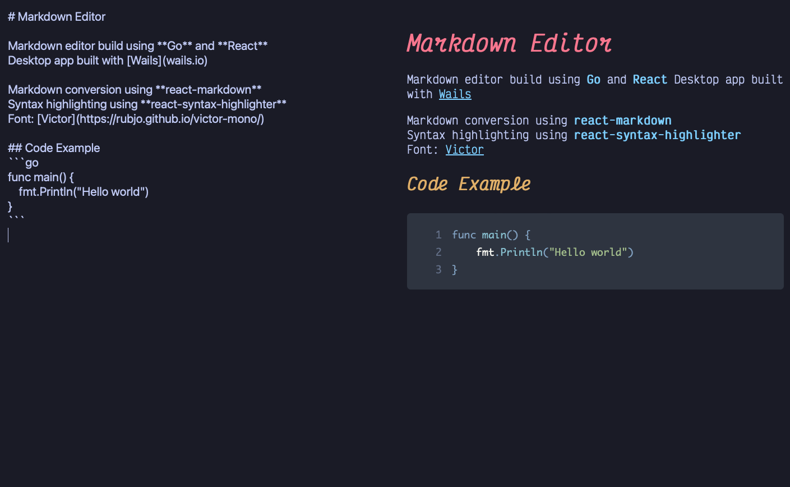

# MarkdownEditor

A simple markdown editor using Go + React

Currently built using [Wails](wails.io) as a standalone desktop app, might build a web app later 

Markdown conversion using [react-markdown](https://github.com/remarkjs/react-markdown) and [react-syntax-highlighter](https://github.com/react-syntax-highlighter/react-syntax-highlighter)
Font: [Victor](https://rubjo.github.io/victor-mono/)

